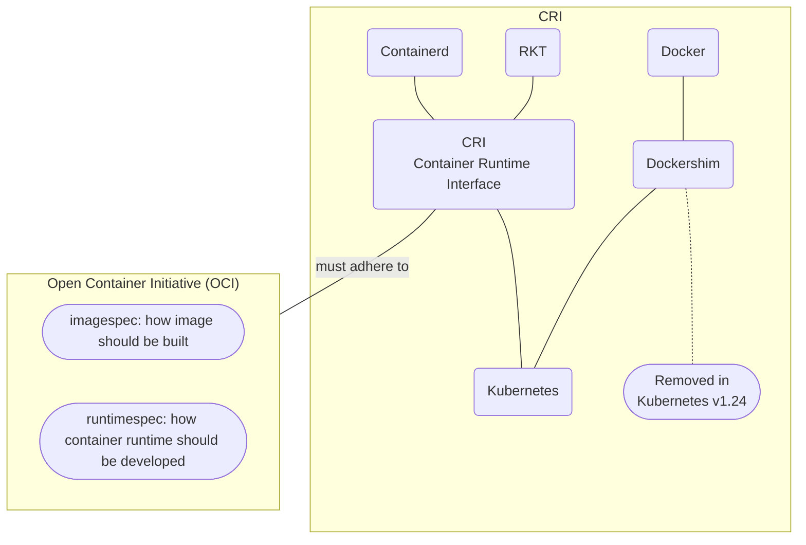

CRI Interaction
#kubernetes 

```mermaid
flowchart TD
  subgraph crigraph["CRI"]
    rkt("RKT")
    containerd("Containerd")
    cri("CRI<br/>Container Runtime Interface")
    docker("Docker")
    dockershim("Dockershim")
    k8s("Kubernetes")
    k8s124(["Removed in<br/>Kubernetes v1.24"])
    
    dockershim -.- k8s124
    dockershim --- k8s
    rkt & containerd --- cri
    docker --- dockershim
    cri --- k8s
  end
  %% OCI
  subgraph oci["Open Container Initiative (OCI)"]
    imagespec([imagespec: how image should be built])
    runtimespec([runtimespec: how container runtime should be developed])
  end
  cri --- |must adhere to| oci
```
