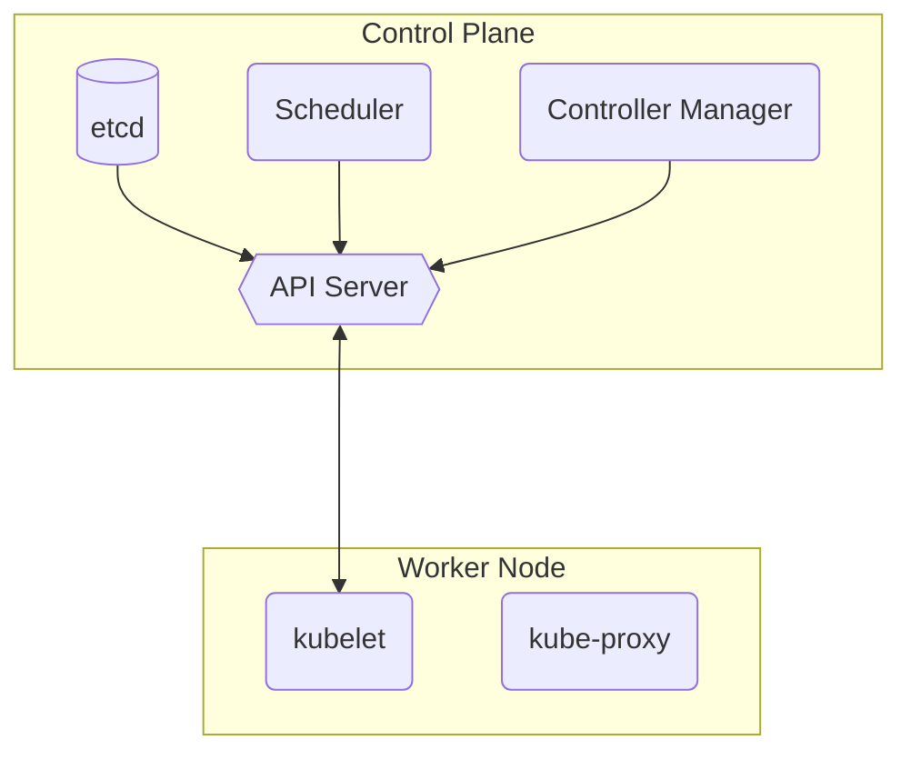
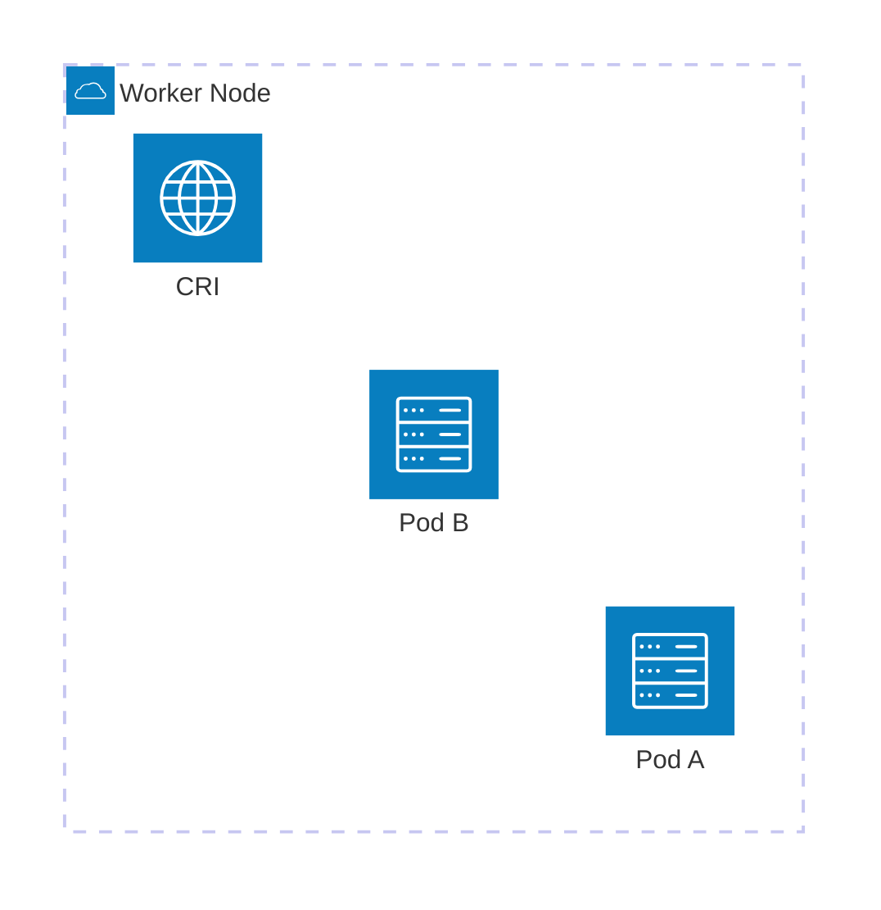

#kubernetes 

```mermaid
flowchart TD

  %% Control Plane
  subgraph CP["Control Plane"]
    apiserver{{API Server}}
    etcd[("etcd")]
    scheduler("Scheduler")
    controller("Controller Manager")
    etcd --> apiserver
    scheduler --> apiserver
    controller --> apiserver
  end

  %% Worker Node
  subgraph N["Worker Node"]
    kubelet("kubelet")
    proxy("kube-proxy")
  end

  %% Connections
  apiserver <---> kubelet
```

```mermaid
architecture-beta
  group wn(cloud)[Worker Node]

  service pod1(server)[Pod A] in wn
  service pod2(server)[Pod B] in wn
  service cri(internet)[CRI] in wn
```
How does the connection between kubelet & API Server happen?